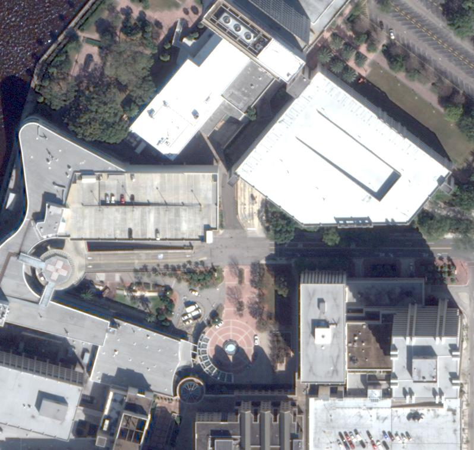

Semantic Neural Radiance Fields for Multi-Date Satellite Data
==

### [Project Page](https://wagnva.github.io/semantic-nerf-for-satellite-data-page/) | [Paper](https://arxiv.org/abs/2502.16992)

**Valentin Wagner, Sebastian Bullinger, Christoph Bodensteiner, and Michael Arens**  
*Fraunhofer Institute of Optronics, System Technologies and Image Exploitation*

---

**Abstract**  
*In this work we propose a satellite specific Neural Radiance Fields (NeRF) model capable to obtain a threedimensional semantic representation (neural semantic field) of the scene. 
The model derives the output from a set of multi-date satellite images with corresponding pixel-wise semantic labels. 
We demonstrate the robustness of our approach and its capability to improve noisy input labels. 
We enhance the color prediction by utilizing the semantic information to address temporal image inconsistencies caused by non-stationary categories such as vehicles. 
To facilitate further research in this domain, we present a dataset comprising manually generated labels for popular multi-view satellite images.*

---

**Overview**

  

Overview of our proposed model. The satellite-domain-adapted outputs(i.e. elements in the blue area)  are combined using an irradiance lighting model to produce the color rendering as originally
proposed by [SatNeRF](https://arxiv.org/abs/2203.08896). Using an additional semantic head (i.e. elements in the red area) our proposed method
is able to produce a corresponding semantic pixel-wise labeling. We combine this with the learned lighting scalar to create
a three-dimensional semantic visualization. We introduce a transient regularization loss $L_t$ to reduce artifacts in the 
learned appearance based on the semantic input data.

---

## Dataset
As part of this work we release manually generated pixel-wise annotations for four scenes of the
[DFC2019 - Track-3](https://ieee-dataport.org/open-access/data-fusion-contest-2019-dfc2019) dataset.
The annotations and accompanying RGB visualizations can be found in [dataset.zip](dataset.zip).

  
  
  
  
  
    
  
  

> [!IMPORTANT]  
> To train our proposed semantic NeRF for satellite data you still need to additionally download the 
> [DFC2019 - Track-3](https://ieee-dataport.org/open-access/data-fusion-contest-2019-dfc2019) dataset.

## Data Preparation
This section describes how the 
[DFC2019](https://ieee-dataport.org/open-access/data-fusion-contest-2019-dfc2019) dataset + 
our accompanying annotations can be combined and preprocessed to be used for training and evaluation of our proposed NeRF.

#### 1. [Setup Conda](docs/dataset_prep.md)
#### 2. [Configuration and Preprocessing](docs/dataset_prep.md#configuration-and-preprocessing)

### Training & Evaluation:
This section describes how to train and evaluate our proposed semantic nerf for satellite data. 
#### 1. [Setup Conda](docs/setup.md)
#### 2. [Training](docs/training.md)
#### 3. [Evaluation](docs/evaluation.md)

